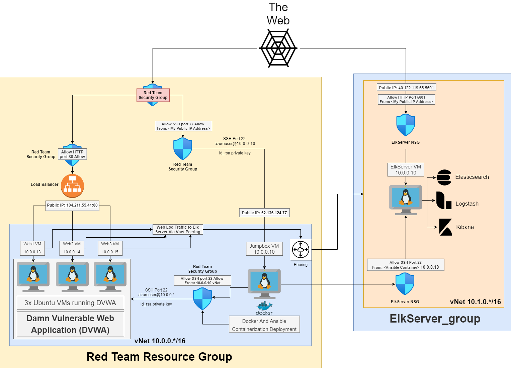

# Elk Stack Documentation
>Elasticsearch Logstash & Kibana (ELK)

### SUMMERY: During our class we deployed a new VM that has an ELK Stack service running on it. This
ELK Stack service allows us to track and manage logs for our WebVM machines all in one place.

#### The cloud isn't anything new either it has been around for a long time, it has just become more viable in the past decade with the ease of use and configuration. Now anyone can easily utilize cloud computing in todays era
>Cloud computing is really a no-brainer for any start-up because it allows you to test your business plan very quickly for little money. Every start-up, or even a division within a company that has an idea for something new, should be figuring out how to use cloud computing in its plan. Brad Jefferson, Animoto CEO. 2009.

#### Terminology
- VM - Virtual Machine
- VNet - Virtual Network
- VPN - Virtual Private Network
- NSG - Network Security Group
- SSH - Secure Shell Protocol

## Ansible Container
>Our Ansible Container is used to help us automatically role out updates and other various images to our machines, this allows us to configure many machines at once automatically through configurable YAML files known as *Playbooks*.
- Our Ansible Container is running under a docker image in our JumpboxVM, our Jumpbox VM allows us to connect to it using our private SSH key and only allows inbound connections from our local Public IP address, the JumpboxVM is our administrative access point where we can control and configure our WebVMs, ELK Stack server, and Ansible Container all from one secure location
- To Connect to our Ansible Container we first have to make sure it is running with the following command: 
`sudo docker container list -a`
- If it isn't running you can start the container with
`sudo docker start <container_name>`
- If it is already running you can simply join it with
`sudo docker attach <container_name>`
- From here we can run our playbooks located in `/etc/ansible/` with the following command: `ansible-playbook <playbook-file>.yml`

## ELK Stack Network Diagram
>Our ELK Stack is in a new Resource Group which houses all of the resources for our new ELK Stack Server

- Resource Name: ElkServer_group
- ELK VNet: 10.1.0.*/16
- Virtual Machine Private IP: 10.0.0.10
- Public Static IP Address: http://40.122.119.65:5601
- We have a Peering in our Red_Team_Resource_Group's VNet 10.0.0.*/16 that allows us to virtually jump from one private network to the other

## Deploying our ELK Stack Container
>We utilize our Ansible Container to allow us to quickly and easily spin our an ELK Stack container, this is very benifical because not only do we save time and headache from configuring our tools and software but it also allows us to deploy many at one time if we wanted to for no more extra configuration besides specifing another IP Address
- Under our Ansible Container we modify the `/etc/ansible/hosts` file and add a new group called elk under our webservers from an eariler class
`[elk]  
10.1.0.4 ansible_python_interpreter=/usr/bin/python3`
- Next we add [install-elk](install-elk.yml) into our '/etc/ansible' folder
- Finally we can run it with: `ansible-playbook filebeat-playbook.yml` from within our /etc/ansible folder

## What is Filebeat and Metricbeat
>This ELK Server also has Filebeat and Metricbeat running from our WebVMs. These WebVMs talk out through the peering directly to our ELK Stack Machine to capture our Machines's Data.
- Filebeat
>Filebeat is a service that watches over specified files and directories that you set in your configuration file, this is useful so you will know if a file or directory has be altered or changed in anyway with a log report of the activity, this in turn allows us to know if someone has modified a file or directory they shouldn't have.

- Metricbeat
>Metricbeat is a service that captures system level monitoring, these can be things such as CPU usage, Memory, Network usage, and even system processes running on your system.

- These are used to moitor the integrity and avaliability of our WebVMs

## Deploying Filebeat and Metricbeat
>We will be going over how we deployed our Filebeat and Metricbeat instances to our WebVMs via Ansible

- Filebeat and Metricbeat are automatically deployed via our Jumpbox Container's Ansible, and only requires 2 ansible playbooks and 2 configuration files to deploy and run on our Web machines
- these files can be found here: [filebeat-configuration.yml](./Resources/filebeat-configuration.yml) [filebeat-playbook.yml](./Resources/filebeat-playbook.yml) [metricbeat-configuration.yml](./Resources/metricbeat-configuration.yml) [metricbeat-playbook.yml](./Resources/metricbeat-playbook.yml)
- To run these files, we save the filebeat-configuration and metricbeat-configuration to: `/etc/ansible/files/` note you will need to make the 'files' directory if it does not already exist, if Ansible is not a directory then you do not have Ansible installed and should reload the class image from our the previous cloud class
- Now we save the playbook files to our `/etc/ansible/` and change our current directory to there with the following command: `cd `/etc/ansible/`
- Finally we can run the playbook files with: `ansible-playbook filebeat-playbook.yml` and `ansible-playbook ` and `metricbeat-playbook.yml`
- You will get a message at the end of the deployment if it was successful or not, if it fails to connect to the VMs you can try Pinging their private IPs: 10.0.0.13-15 to see if there is a connection issue. If there is you will probably have to check the Pairing to make sure it allows the connection and if your machines are up and running.

## Network Table
>Here you can view the entire ELK resource info in a table, you can also view it in EXCEL if you wish to do so [HW13 Network Tables](./HW13_Network_Tables.xlsx), this table was generated via: https://tabletomarkdown.com/convert-spreadsheet-to-markdown/

| Resource Type           | Resource Name        |                                |                    |           |                   |                |        |
| ----------------------- | -------------------- | ------------------------------ | ------------------ | --------- | ----------------- | -------------- | ------ |
| Resource Group          | RedTeamCloud         |                                |                    |           |                   |                |        |
|                         |                      |                                |                    |           |                   |                |        |
| Virtual Network         | RedTeamVnet          | Subnet                         | 10.0.0.0/16        |           |                   |                |        |
|                         |                      |                                |                    |           |                   |                |        |
| Virtual Machines        | Name                 | Public IP Address              | Private IP Address | Region    |                   |                |        |
|                         | Jump-Box-Provisioner | 52.136.124.77                  | 10.0.0.10          | East US   |                   |                |        |
|                         | Web-1                | 104.211.55.41 (Load Balancer)  | 10.0.0.13          | East US   |                   |                |        |
|                         | Web-2                | 104.211.55.41 (Load Balancer)  | 10.0.0.14          | East US   |                   |                |        |
|                         | Web-3                | 104.211.55.41 (Load Balancer)  | 10.0.0.15          | East US   |                   |                |        |
|                         |                      |                                |                    |           |                   |                |        |
| Load Balancer           | Name                 | Public IP Address              |                    |           |                   |                |        |
|                         | RedTeamLoadBalancer  | 104.211.55.41                  |                    |           |                   |                |        |
|                         |                      |                                |                    |           |                   |                |        |
| Network Security Group  | Name                 |                                |                    |           |                   |                |        |
|                         | RedTeamSecGroup      |                                |                    |           |                   |                |        |
| Inbound Security Rules  | Priority             | Name                           | Source Port        | Protocall | Source            | Destination    | Action |
|                         | 3700                 | Webservers                     | 80                 | TCP       | Any               | Any            | Allow  |
|                         | 3800                 | InternalSSHVPN                 | 22                 | TCP       | 10.0.0.10         | VirtualNetwork | Allow  |
|                         | 4000                 | JumpVMSSH                      | 22                 | TCP       | 143.59.\*.\*      | Any            | Allow  |
|                         | 65000                | AllowVnetInBound               | Any                | Any       | VirtualNetwork    | VirtualNetwork | Allow  |
|                         | 65001                | AllowAzureLoadBalancerInBound  | Any                | Any       | AzureLoadBalancer | Any            | Allow  |
|                         | 65500                | DenyAllInBound                 | Any                | Any       | Any               | Any            | Deny   |
|                         |                      |                                |                    |           |                   |                |        |
| Outbound Security Rules | Priority             | Name                           | Source Port        | Protocall | Source            | Destination    | Action |
|                         | 65000                | AllowVnetOutBound              | Any                | Any       | VirtualNetwork    | VirtualNetwork | Allow  |
|                         | 65001                | AllowAzureLoadBalancerOutBound | Any                | Any       | Any               | Internet       | Allow  |
|                         | 65500                | DenyAllOutBound                | Any                | Any       | Any               | Any            | Deny   |

| Resource Type           | Resource Name        |                                |                    |            |                   |                |        |
| ----------------------- | -------------------- | ------------------------------ | ------------------ | ---------- | ----------------- | -------------- | ------ |
| Resource Group          | ElkServer\_group     |                                |                    |            |                   |                |        |
|                         |                      |                                |                    |            |                   |                |        |
| Virtual Network         | RedTeamVnet          | Subnet                         | 10.1.0.0/16        |            |                   |                |        |
|                         |                      |                                |                    |            |                   |                |        |
| Virtual Machines        | Name                 | Public IP Address              | Private IP Address | Region     |                   |                |        |
|                         | Jump-Box-Provisioner | 40.122.119.65 (StaticIP)       | 10.1.0.4           | Central US |                   |                |        |
|                         |                      |                                |                    |            |                   |                |        |
| Load Balancer           | Name                 | Public IP Address              |                    |            |                   |                |        |
|                         | ElkServerStaticIP    | 40.122.119.65                  |                    |            |                   |                |        |
|                         |                      |                                |                    |            |                   |                |        |
| Network Security Group  | Name                 |                                |                    |            |                   |                |        |
|                         | ElkServer-nsg        |                                |                    |            |                   |                |        |
| Inbound Security Rules  | Priority             | Name                           | Source Port        | Protocall  | Source            | Destination    | Action |
|                         | 1000                 | JumpVMSSH                      | 5601               | TCP        | 143.59.\*.\*      | Any            | Allow  |
|                         | 1100                 | SSHPeering                     | 22                 | TCP        | 10.0.0.10         | VirtualNetwork | Allow  |
|                         | 65000                | AllowVnetInBound               | Any                | Any        | VirtualNetwork    | VirtualNetwork | Allow  |
|                         | 65001                | AllowAzureLoadBalancerInBound  | Any                | Any        | AzureLoadBalancer | Any            | Allow  |
|                         | 65500                | DenyAllInBound                 | Any                | Any        | Any               | Any            | Deny   |
|                         |                      |                                |                    |            |                   |                |        |
| Outbound Security Rules | Priority             | Name                           | Source Port        | Protocall  | Source            | Destination    | Action |
|                         | 65000                | AllowVnetOutBound              | Any                | Any        | VirtualNetwork    | VirtualNetwork | Allow  |
|                         | 65001                | AllowAzureLoadBalancerOutBound | Any                | Any        | Any               | Internet       | Allow  |
|                         | 65500                | DenyAllOutBound                | Any                | Any        | Any               | Any            | Deny   |